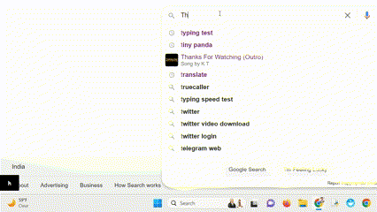

# Interactive Input Tracker Chrome Extension

## Overview

"Interactive Input Tracker" is a Chrome extension designed to provide real-time textual feedback for every user action, enhancing your awareness of digital interactions during browsing sessions. The extension displays a dynamic log of actions at the bottom left of the screen, including keystrokes and mouse clicks.

## Features

- Real-time tracking of user actions.
- Display of simple and complex keystrokes (e.g., 'A', 'Alt + B').
- Recognition of mouse clicks, including Left Mouse Button (LMB) and Right Mouse Button (RMB).

## Installation

1. Clone or download the repository.
2. Open Chrome and go to `chrome://extensions/`.
3. Enable "Developer mode" in the top right corner.
4. Click on "Load unpacked" and select the folder where you cloned or downloaded the extension.
